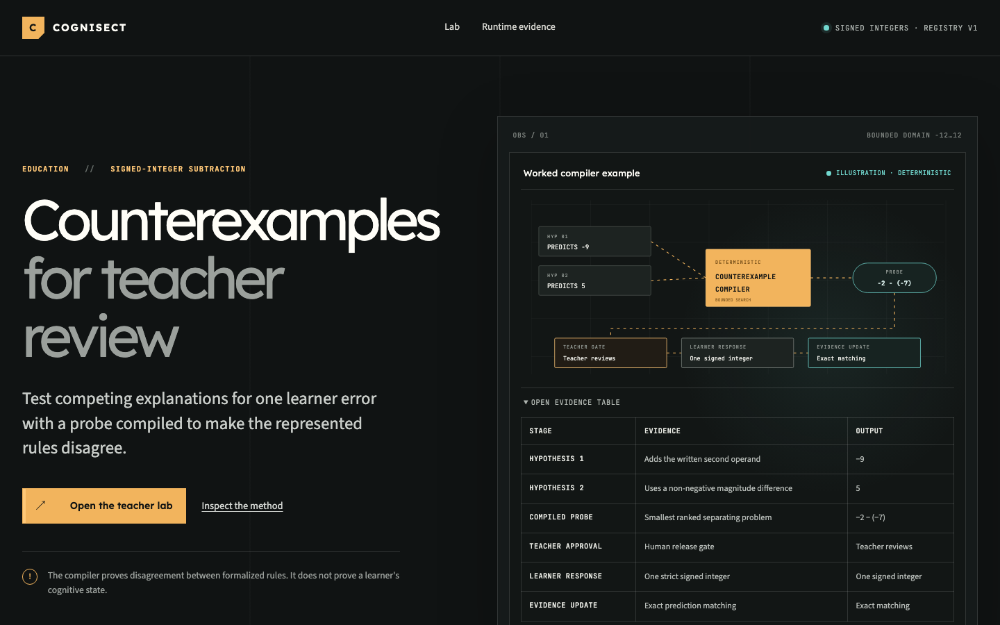
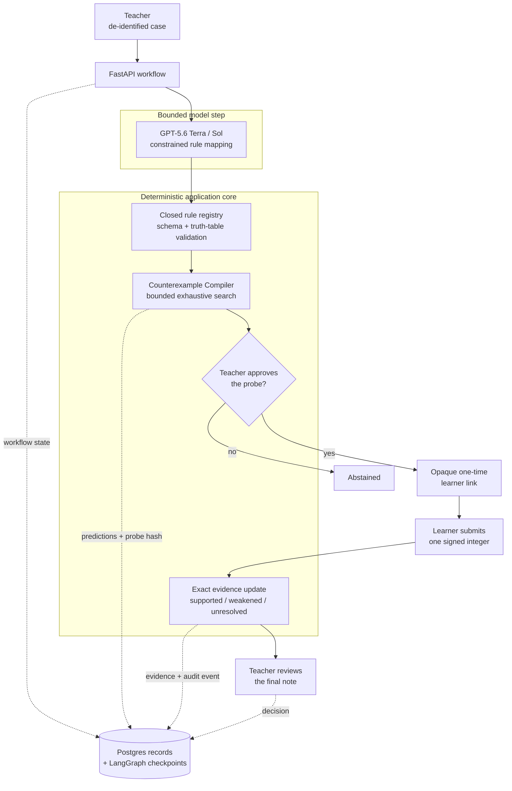

<p align="center">
  
</p>

# COGNISECT

**Compile the next question, not a diagnosis.**

COGNISECT helps a secondary mathematics teacher test competing explanations for
one signed-integer subtraction error. GPT-5.6 maps observed work into a closed,
literature-grounded rule registry; a deterministic Counterexample Compiler finds
the smallest follow-up problem on which the represented rules disagree.

[](https://github.com/StephenSook/cognisect/actions/workflows/ci.yml)
[](https://cognisect.vercel.app)
[](LICENSE)

**[Try the live preview](https://cognisect.vercel.app)** ·
**[Open the teacher lab](https://cognisect.vercel.app/lab)** ·
**[Inspect runtime evidence](https://cognisect.vercel.app/runtime)**

The compiler proves disagreement between formalized rules. It does not prove a
learner's cognitive state.

## The problem

One wrong answer can fit more than one plausible procedure. A model that selects
one explanation too early can turn ambiguity into an unjustified diagnosis.
COGNISECT preserves the alternatives long enough to ask a question that actually
separates them, while keeping the teacher in control of what reaches the learner.

## Judge path

1. Open the [teacher lab](https://cognisect.vercel.app/lab) and choose a
   provenance-cleared public case.
2. Review the constrained rule hypotheses and the compiled separating probe.
3. Approve the probe, then open its learner link in a separate browser context.
4. Submit one signed integer, return to the report, and inspect the persisted
   evidence update.
5. Save the final teacher decision—approve, edit, reject, or abstain—then refresh
   the report to read the persisted decision back alongside the audit record.

The preview uses free Vercel, Render web, and Render Postgres resources, so the
first request may cold-start.

## COGNISECT in one loop

> A teacher submits de-identified observed work. GPT-5.6 ranks instances from an
> closed, literature-grounded rule registry. The Counterexample Compiler searches
> all 625 bounded subtraction problems and persists the smallest probe where the
> leading alternatives disagree. The teacher approves it, the learner submits one
> signed integer, exact matching updates the evidence, and the teacher approves,
> edits, rejects, or abstains on the final note.

## What is real

| Component | Shipped behavior |
| --- | --- |
| Constrained model mapping | GPT-5.6 Terra and Sol return strict structured instances from `rule_registry.v1`; they cannot author executable rules. |
| Counterexample Compiler | Exhaustive deterministic search over `a - b`, where both operands are in `[-12, 12]`; a probe is released only when represented rules disagree. |
| Evidence update | One strict signed integer is matched exactly against predictions and labeled `supported`, `weakened`, `unresolved`, or `abstained`. |
| Human custody | The teacher approves the probe and separately approves, edits, rejects, or abstains on the final note. |
| Durable workflow | FastAPI, Postgres, SQLAlchemy, Alembic, and LangGraph checkpoints preserve interrupt and resume state. |
| Capability security | Teacher and learner links use separate high-entropy capabilities with hashed verifiers, atomic response recording, replay protection, and deletion. |

## Architecture



The model proposes only registry data. Authorization, rule execution, probe
selection, response matching, state transitions, and teacher approval remain in
deterministic application code.

## How Codex helped build COGNISECT

The Git history makes the Codex collaboration traceable. Codex helped implement
and test the deterministic signed-integer core in `af43cc2`, the durable Postgres
workflow in `2b9fd53`, the Responses API workflow in `42e5bef`, and the full
vertical slice in `9884be9`.

Product scope, evidence vocabulary, privacy boundaries, human gates, and final
claim decisions were human decisions. GPT-5.6 remains constrained to mapping
observed work into registry instances; deterministic code and explicit teacher
decisions control every learner-facing transition.

## Measured evidence

| Gate | Checked result |
| --- | --- |
| Frozen model comparison | 12 live model calls across six educator-authored fixtures |
| Schema and registry acceptance | Terra 6/6; Sol 6/6 |
| Exact expected rule set | Terra 4/6; Sol 5/6 |
| Separating probe and hash reproduction | 6/6 Terra mappings |
| Concurrent learner submissions | 1 accepted and 49 conflicted out of 50 |
| Targeted security tests | 145 passed |
| Playwright journeys | 8 desktop, mobile, accessibility, replay, expiry, abstention, and deletion journeys passed |
| Learner responses used for evaluation | Zero learner responses |

This is a small project-authored harness, not a generalized accuracy estimate.
No educator usability review, classroom adoption, learning improvement, or
teacher time-saving result is claimed. See the [evaluation report](docs/EVALUATION.md)
and [security report](docs/SECURITY.md) for methods and limitations.

## Quickstart

Python 3.12, Node 22, `uv`, and Docker are required.
CI uses Node 22.22.2. Both frontend manifests and project npm configuration
enforce npm 10.9.4. Activate that exact package manager before installation:

```sh
corepack enable npm && corepack prepare npm@10.9.4 --activate
test "$(npm --version)" = "10.9.4"
```

```sh
git clone https://github.com/StephenSook/cognisect.git
cd cognisect
cp .env.example .env
docker compose up -d --wait postgres
uv sync --frozen
./scripts/migrate.sh
./scripts/run-backend.sh
```

In a second terminal:

```sh
cd frontend
npm ci
COGNISECT_BACKEND_URL=http://127.0.0.1:8000 npm run dev
```

Replace the three pepper placeholders with distinct random values of at least 32
characters. Generate the shared backend/frontend proxy credential with
`openssl rand -hex 32` and copy its exact unmodified output to
`PROXY_SIGNING_SECRET` and `COGNISECT_PROXY_SIGNING_SECRET`. Set `OPENAI_API_KEY`
to run the production analyzer. Browser requests use the same-origin frontend
proxy; learner links should be tested in a separate browser context.

## Verification

```sh
uv run ruff check backend scripts
uv run mypy backend/src
uv run pytest backend/tests -q
uv run python scripts/validate_provenance.py
uv run python scripts/run_offline_evaluation.py --check
uv run python scripts/run_model_benchmark.py --check
gitleaks git --redact

cd frontend
npm run lint
npm run typecheck
npm test
npm run build
npm run test:e2e
npm ci --prefix tools/openapi-generator
npm run check:peers
npm run check:api
npm audit --audit-level=high
npm audit --audit-level=high --prefix tools/openapi-generator

cd ..
uv export --frozen --no-hashes --no-dev --no-emit-project | uvx --python 3.12 pip-audit -r /dev/stdin
uv run python scripts/generate_dependency_licenses.py --check
```

CI runs six jobs covering hygiene and full-history secret scanning, backend
quality, Postgres integration and property tests, frontend checks, Playwright
accessibility journeys, OpenAPI drift, migrations, and container builds.
The hygiene job installs both exact npm lockfiles, rejects invalid peer trees,
checks both npm graphs at high audit severity, scans the frozen production Python
export, and rejects dependency-license inventory drift. Audit results describe the
locked graphs at execution time; they are not a claim that dependencies are safe.

## Documentation

- [Architecture and API](docs/ARCHITECTURE.md)
- [Rule registry](docs/specs/rule-registry-v1.md), [evidence contract](docs/specs/evidence-contract.md), and [state machine](docs/specs/state-machine.md)
- [Dataset card](docs/DATASET_CARD.md), [data tiers](docs/specs/data-tiers.md), and [evaluation](docs/EVALUATION.md)
- [Security, privacy, and retention](docs/SECURITY.md)
- [Deployment and incident runbook](docs/DEPLOYMENT.md)
- [Third-party notices](THIRD_PARTY_NOTICES.md) and [dependency licenses](docs/DEPENDENCY_LICENSES.md)

## License

Apache-2.0. See [LICENSE](LICENSE), [NOTICE](NOTICE), and
[THIRD_PARTY_NOTICES.md](THIRD_PARTY_NOTICES.md).
